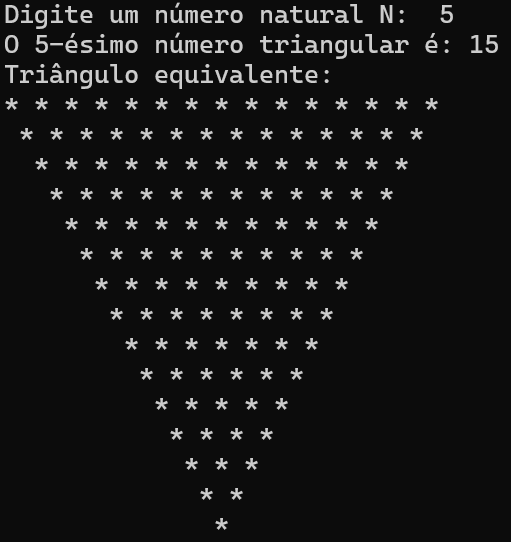

# New Rizon Rriangle

Este é o código realizado no desafio de lógica para um processo seletivo no Bootcamp da New Rizon.
O desafio consiste em fazer um programa que receba um número natural N e determine, por meio de uma rotina recursiva, qual é o N-ésimo número triangular. O programa também imprimi na tela, por meio de outra rotina recursiva, o triângulo equivalente a esse N-ésimo número triangular.



## Pré-requisitos

É imprescindível que você tenha instalado em seu computador o NodeJs para que possa executar e testar este projeto.

- **Node** - [https://nodejs.org/en/download/](https://nodejs.org/pt-br/download/)

## Instalação

 Exemplo:

 Clone esse projeto em seu computador com o comando:

 ```
 	git clone [https://github.com/codedbylucas/new-rizon-triangle.git]
 ```

 Acesse a pasta do projeto seu terminal:

 ```
 	cd [new-rizon-triangle]
 ```


## Execução

Após ter aberto a pasta no seu terminal, execute o comando:

```
 	node index
```


## Autor

- **Lucas Marques** - Desenvolvedor - [Github](https://github.com/codedbylucas) | [Linkedin](https://www.linkedin.com/in/codedbylucas/)
 
